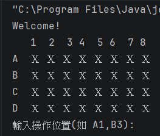
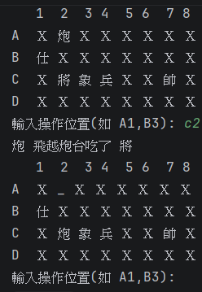

# H1 Report

* Name: 楊凱琪
* ID:D1249903

---

## 題目：象棋翻棋遊戲

## 設計方法概述
先定義好棋子的名稱、大小階級、陣營(紅黑)後，在程式的一開始會先產生旗子，並且透過 `Collections.shuffle` 將順序打亂，最後依序放進大小為32的一維陣列。
透過 `while` 讓遊戲可以不斷進行下去，每次的迴圈，程式都會執行以下步驟：
+ 印出目前的棋盤狀態
+ 要求玩家輸入要操作的位置，並將輸入的字母和數字轉成陣列編號
+ 邏輯判斷
  + 若選到暗棋 &rarr; 直接翻開
  + 若遇到已經翻開的己方棋子 &rarr; 先記住這個位置，並在玩家輸入下一個位置時移動或吃子
  + 在移動或吃子前，程式會檢查是否符合規則
    + 一般棋子只能走相鄰一格，且階級必須 &ge; 對方
    + **炮/包** 要隔一顆棋子才能吃子
    + 若不符合規則 &rarr; 印出錯誤提示並回到原狀

## 程式、執行畫面及其說明
執行程式後，會出現 4 * 8 的棋盤，上面的 X 代表暗棋，並且提示使用者輸入



透過 `Collections.shuffle` 洗牌，並在 `showAllChess` 中透過 `index = r * 8 + c` 將棋子能以 4*8 的形式顯示在棋盤上。
若某位子沒有棋子，以 `_` 顯示。

```java
    public void showAllChess(){
        System.out.println("   1  2  3 4  5 6  7 8");
        char[] rowLabels = {'A', 'B', 'C', 'D'};

        for (int r = 0;r < 4;r++){
            System.out.print(rowLabels[r] + " ");
            for (int c = 0;c < 8;c++){
                int index = r * 8 + c;

                Chess piece = board[index];
                if (piece == null){
                    System.out.print(" _");
                }else{
                    System.out.print(" " + piece.toString());
                }

            }
            System.out.println(); // 換行
        }

    }
```

**炮/包** 隔一顆棋子吃子的部分如下圖所示



在 `move` 方法中，將炮/包的邏輯判斷獨立出來。
透過 `isValidCannonCapture` 確認與目標棋子之間是否只差一顆棋子。

```java
private boolean isValidCannonCapture(int from, int to) {
        int r1 = from / 8, c1 = from % 8;
        int r2 = to / 8, c2 = to % 8;

        // 必須在同一直線或橫線上
        if (r1 != r2 && c1 != c2) return false;

        int count = 0; // 計算中間的棋子數

        if (r1 == r2) { // 同一列 (橫向移動)
            int minCol = Math.min(c1, c2);
            int maxCol = Math.max(c1, c2);
            for (int c = minCol + 1; c < maxCol; c++) {
                if (board[r1 * 8 + c] != null) count++;
            }
        } else { // 同一行 (縱向移動)
            int minRow = Math.min(r1, r2);
            int maxRow = Math.max(r1, r2);
            for (int r = minRow + 1; r < maxRow; r++) {
                if (board[r * 8 + c1] != null) count++;
            }
        }
        
        return count == 1;
    }
```


# AI 使用狀況與心得

+ 使用層級：3
+ 互動次數與內容
  + 我與 AI 大約進行了十幾次的互動，包括在上課時沒有完全理解的概念，如：
    + `toString()` 覆寫
    + 為何要使用 `@override`
  + 以及在程式碼中與象棋有關的邏輯撰寫
  + Prompt：讓 AI 引導我撰寫，而非直接給我答案，讓我清楚自己不懂的地方在哪裡
+ 手動部分
  + 類別宣告
  + `toString()` 內部邏輯
  + 字串與座標轉換邏輯
  + 吃子規則判定
  + 更新物件屬性

## 心得
在以前沒修過物件導向課程的狀態下，讓我在使用 java 的過程中非常生疏，為了幫助自己理解，因此使用 AI 以引導學習的方式讓我更快上手。
使用過程中，AI 忽略了炮/包吃子的特殊規則，於是我將台灣暗棋規則當成 prompt 餵給 AI，讓 AI 引導我寫出 `isValidCannonCapture`。
這次的作業我學到了很多與 java 相關的知識，一步一步跟著 AI 的步伐完成，讓我不再對 java 的使用感到盲目，也加深了很多實作的印象。